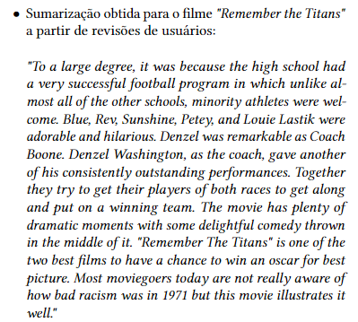
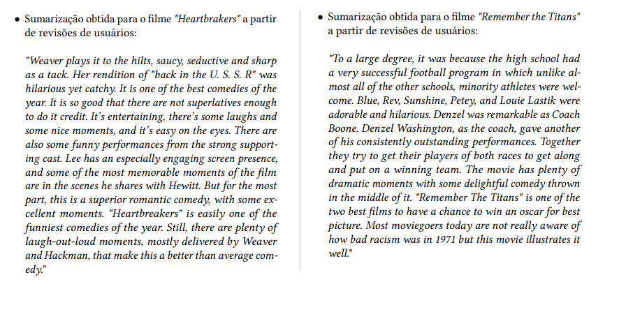

# Text-Summarization-for-Recommendations

## Table of Contents

- [About](#about)
- [Results](#results)
- [Methodology](#methodology)

---

## About

<table>
<tr>
<td>  
    Users Review Summarizer to provide natural language justifications about a recommendation provided by a movie recommender system. Given users reviews about a belonging item of the recommender system, the most relevant aspects of an item are extracted from textual reviews. After the sentimental analysis phase, a summary about the item is generated considering the emotionally positive aspects extracted in relation to the movie. 
</td>
</tr>
</table>

## Results

Some results for the movies "Remember the Titans" and "", respectively.

<table>
<tr>
<td>  
    
     

</td>
</tr>
</table>

## Methodology

TO DO